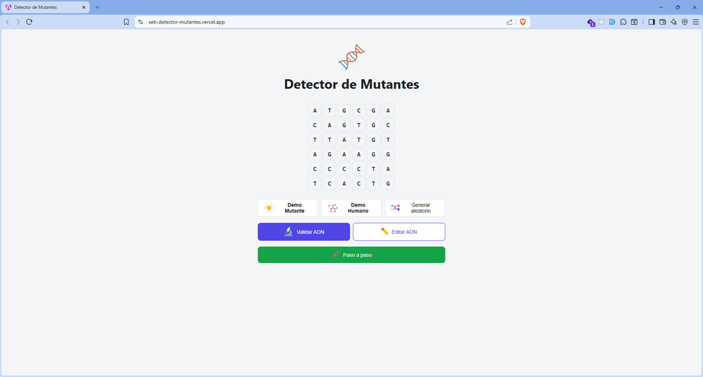
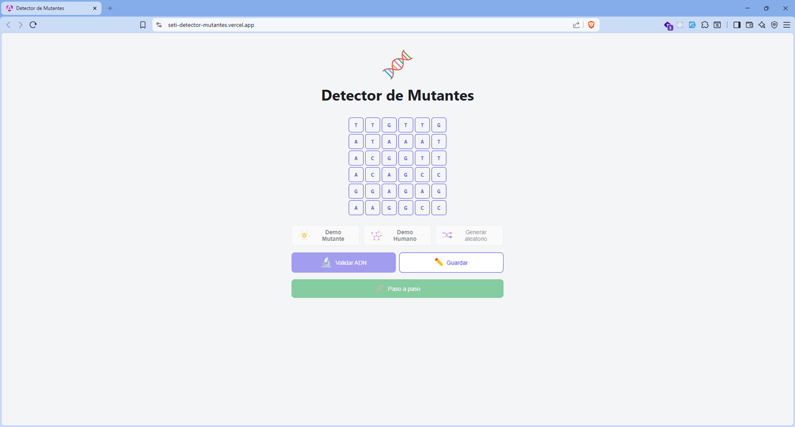
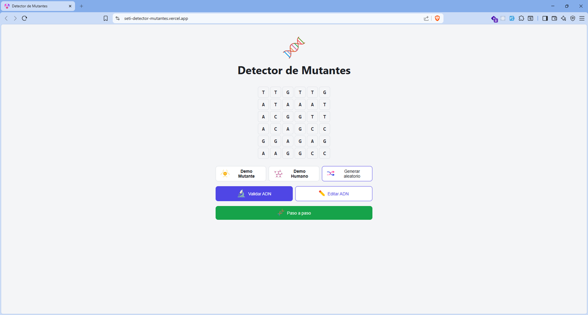
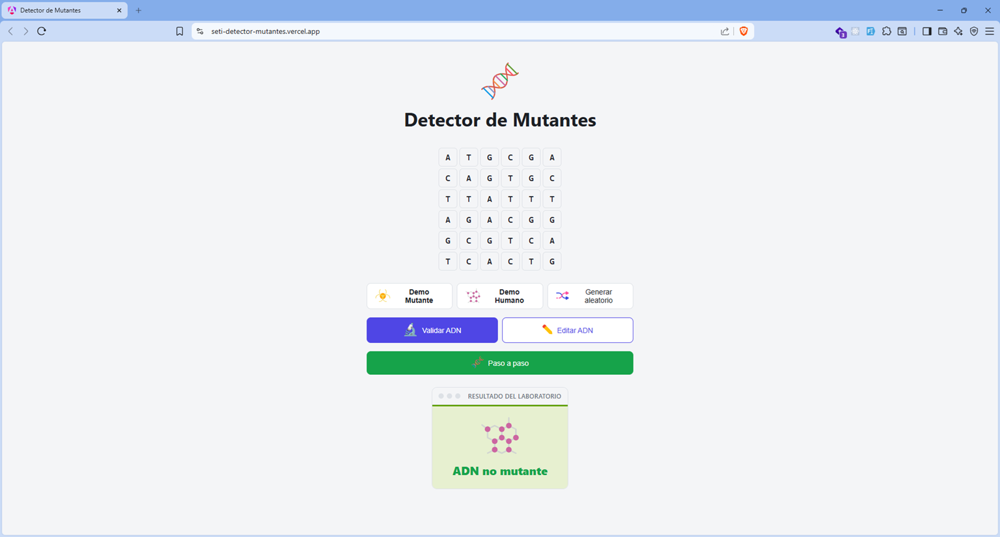
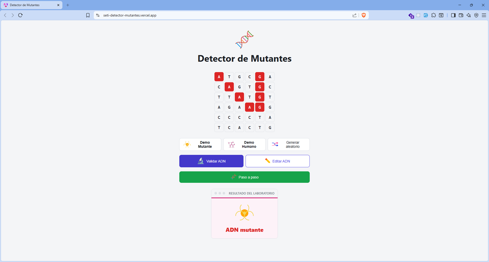
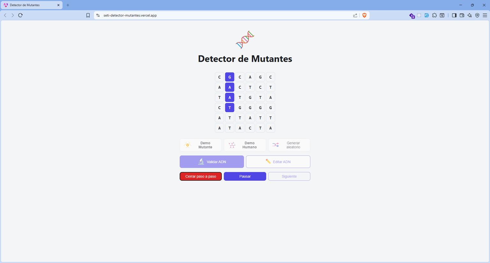
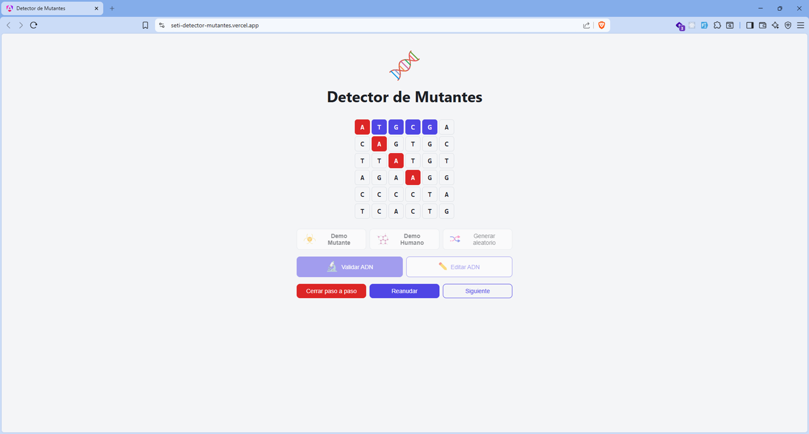
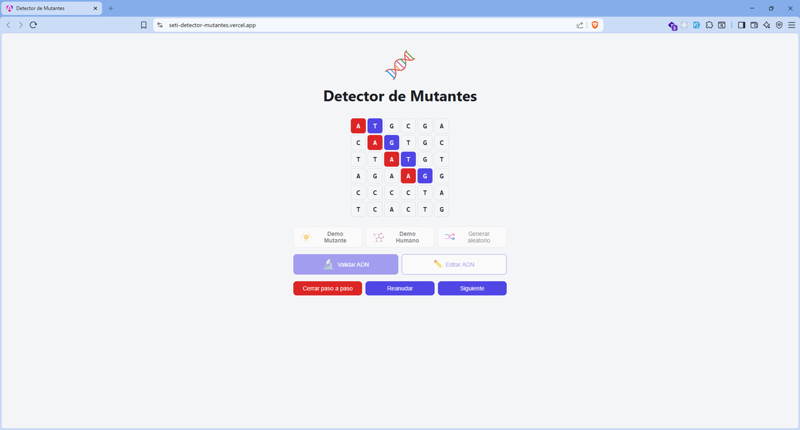
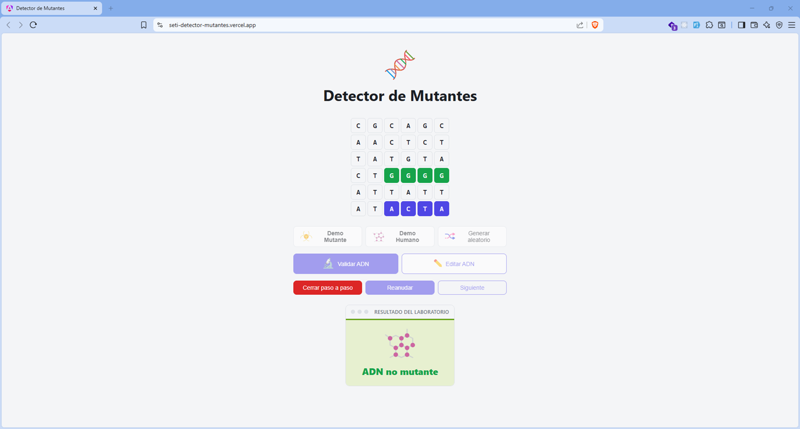
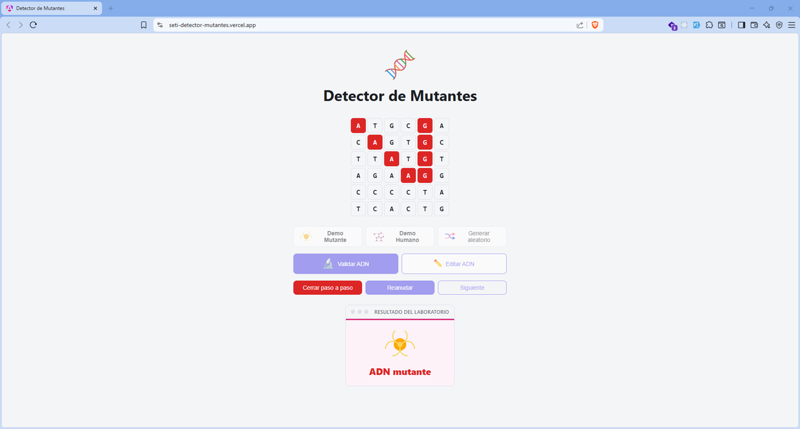

# Detector de Mutantes

Este proyecto implementa la solución al clásico reto de detección de mutantes mediante ADN.

El algoritmo recibe una matriz NxN compuesta por las bases nitrogenadas **A**, **T**, **C** y **G**, y determina si el ADN pertenece a un mutante buscando secuencias repetidas de cuatro letras consecutivas.

Sobre esa solución se construyó una aplicación web interactiva en Angular que permite visualizar, comprender y probar el algoritmo de forma interactiva.

**Demo en vivo:** [https://seti-detector-mutantes.vercel.app/](https://seti-detector-mutantes.vercel.app/)

---

## Tecnologías utilizadas

- Angular 22
- TypeScript
- Signals
- CSS
- HTML5

---

## Descarga

Clona el repositorio en tu máquina:

```bash
git clone https://github.com/dejeloper/SETI_detector-mutantes.git
cd SETI_detector-mutantes
```

## Levantar el proyecto

Instala las dependencias y arranca el servidor de desarrollo:

```bash
pnpm install
pnpm start
```

Abre tu navegador en [http://localhost:4200](http://localhost:4200). Los cambios se reflejan automáticamente al guardar un archivo.

---

## Qué hace el proyecto

El ADN se representa como una matriz cuadrada (NxN) formada por las bases nitrogenadas: **A** (Adenina), **T** (Timina), **C** (Citosina) y **G** (Guanina). El algoritmo recorre esa matriz buscando secuencias de **4 letras iguales consecutivas** en cuatro direcciones: horizontal, vertical y las dos diagonales.

Si encuentra **dos o más** de esas secuencias, el ADN pertenece a un **mutante**. Si encuentra una sola o ninguna, es de un **humano**.

Por ejemplo, en este ADN mutante hay una diagonal de cuatro "A" y una horizontal de cuatro "C":

```
A T G C G A
C A G T G C
T T A T G T
A G A A G G
C C C C T A
T C A C T G
```

---

## Algoritmo

El algoritmo inspecciona cada posición de la matriz como si pudiera ser el inicio de una secuencia.

Desde cada celda únicamente revisa cuatro direcciones:

- `→` Horizontal
- `↓` Vertical
- `↘` Diagonal principal
- `↙` Diagonal secundaria

Cuando encuentra cuatro letras consecutivas iguales incrementa un contador. En cuanto detecta **dos secuencias**, finaliza inmediatamente devolviendo `true` sin seguir recorriendo la matriz.

Antes de evaluar las secuencias, valida que la matriz sea cuadrada y que solo contenga las bases `A`, `T`, `C` y `G`.

Este mismo recorrido tiene dos formas de ejecutarse desde `DNAService`:

- `isMutant(dna)`: devuelve únicamente el resultado (`isMutant`, `hasError`, `errorMessage`). Es la validación instantánea que usa el botón **Validar ADN**.
- `scan(dna)`: devuelve, además del resultado, cada comparación hecha en el camino (`DNAStep[]`: dirección, las 4 celdas revisadas y si coincidieron). Es lo que alimenta el modo **Paso a paso** para animar el recorrido.

Un algoritmo típico solo responde `true` o `false`. `scan()` lo convierte en un algoritmo observable: además del resultado, expone exactamente qué comparó, en qué orden y por qué llegó a esa conclusión.

## Complejidad

- **Tiempo:** O(N²)
- **Espacio:** O(1)

Cada posición de la matriz se evalúa como posible inicio de una secuencia en cuatro direcciones. Como el número de direcciones y el tamaño de cada comprobación son constantes (4), la complejidad total sigue siendo O(N²), sin estructuras auxiliares que crezcan con el tamaño de la matriz. El corte anticipado al llegar a dos secuencias reduce el trabajo real en la mayoría de los casos, especialmente en matrices grandes con mutantes fáciles de detectar.

---

## Funcionalidades

### Editar ADN

La aplicación tiene dos formas de cargar ADN:

- **Demo Mutante / Demo Humano:** cargan ejemplos predefinidos para ver el resultado al instante.
- **Generar aleatorio:** genera una matriz aleatoria del mismo tamaño que la actual.

Para editar manualmente:

1. Haz clic en **Editar ADN**. La grilla cambia a modo edición con bordes resaltados.
2. Escribe directamente en cada celda. Solo se permiten las letras **A**, **T**, **C** y **G**. Si escribes otra cosa, la celda se borra y aparece un aviso.
3. Cuando termines, haz clic en **Guardar**. La aplicación validará automáticamente el ADN que acabas de editar.

La validación de cada celda ocurre en tiempo real: antes de que el resultado se muestre, el código ya verificó que la matriz sea cuadrada y que solo tenga letras válidas, así el usuario se entera de inmediato si algo falla.

### Validación instantánea

El botón **Validar ADN** ejecuta el algoritmo sobre la matriz actual y muestra el resultado de inmediato: mutante o humano, con la secuencia encontrada resaltada en la grilla (verde si es humano, rojo si confirma que es mutante) o el mensaje de error si el ADN no es válido.

### Paso a paso

Además de validar de forma instantánea, la aplicación puede animar el recorrido del algoritmo para ver exactamente qué está comparando en cada momento.

Al hacer clic en **Paso a paso**, la grilla reproduce automáticamente cada comparación (cada 700ms), resaltando en azul las 4 casillas evaluadas en ese instante; cuando una comparación coincide, esas casillas quedan sombreadas de forma permanente (verde si el resultado final es humano, rojo si confirma el mutante). El recorrido se detiene solo al encontrar la segunda secuencia o al terminar de revisar toda la matriz.

Mientras el modo está activo, se puede pausar/reanudar la reproducción o avanzar paso a paso manualmente en pausa, y el botón principal cambia a **Cerrar paso a paso** (en rojo) para salir en cualquier momento; el resto de los botones quedan bloqueados hasta entonces.

### Persistencia

Lo que edites o cargues se guarda automáticamente en el navegador. Si cierras la pestaña y la vuelves a abrir, el ADN que tenías sigue ahí. Esto funciona con la memoria del navegador, así que si borras los datos del sitio, la grilla vuelve al ejemplo por defecto.

Si tienes dos pestañas abiertas al mismo tiempo, los cambios en una se reflejan en la otra automáticamente.

---

## Capturas

| Inicio                                  | Modo edición                                       | Generar aleatorio                                     |
| --------------------------------------- | -------------------------------------------------- | ----------------------------------------------------- |
|  |  |  |

| Validación humano                                             | Validación mutante                                              |
| ------------------------------------------------------------- | --------------------------------------------------------------- |
|  |  |

| Paso a paso en curso                                                | Paso a paso pausado                                                | Paso a paso: Siguiente                                                  |
| --------------------------------------------------------------------- | ------------------------------------------------------------------- | -------------------------------------------------------------------- |
|  |  |  |

| Paso a paso: resultado humano                                        | Paso a paso: resultado mutante                                         |
| ----------------------------------------------------------------------- | -------------------------------------------------------------------- |
|  |  |

---

## Arquitectura

El proyecto está hecho con **Angular 22** y está organizado en componentes pequeños que cada uno hace una cosa:

- **Board** (`board/`): es el coordinador. Decide qué se muestra, cuándo validar, qué hacer con los resultados y orquesta la animación del modo paso a paso (reproducir, pausar, avanzar).
- **Grid** (`grid/`): dibuja la matriz de ADN, permite editar las celdas en modo edición y resalta las celdas que Board le indique (comparación actual o secuencia encontrada).
- **Buttons** (`buttons/`): muestra los botones de acción (cargar demo, generar aleatorio, editar, validar, paso a paso, pausar/reanudar, siguiente).
- **Results** (`results/`): muestra el resultado de la validación con un icono que indica si es mutante o humano.
- **DNAService** (`core/services/`): contiene el algoritmo de detección. Expone `isMutant()` (resultado directo) y `scan()` (resultado + cada comparación hecha, para animar).
- **Modelos** (`core/models/`): `dna-result.model.ts` define el resultado de `isMutant()`; `dna-step.model.ts` define cada paso (`DNAStep`) y el resultado de `scan()`.

```text
App -> Board(Grid, Buttons, Results) -> DNAService(isMutant(), scan())
```

---

## Decisiones de diseño

- El algoritmo está desacoplado de Angular: vive en `DNAService` y no depende de nada de la interfaz.
- Toda la lógica de negocio vive en el servicio; los componentes únicamente muestran información y emiten eventos.
- El recorrido termina en cuanto se encuentran dos secuencias, evitando trabajo innecesario.
- La edición se realiza sobre una copia de la matriz hasta que el usuario guarda los cambios, para no mutar el estado validado a mitad de la edición.
- El modo paso a paso reutiliza el mismo `scan()` del servicio, así que la animación y la validación instantánea siempre muestran el mismo resultado.
- Mientras el paso a paso está activo, el resto de las acciones (demos, aleatorio, validar, editar) se deshabilitan para evitar cambiar el ADN a mitad de una animación en curso.

---

## Complejidad cognitiva

Cada componente y cada método tienen una única responsabilidad (ver [Decisiones de diseño](#decisiones-de-diseño)), lo que mantiene el código fácil de leer, depurar y modificar sin efectos secundarios inesperados.
