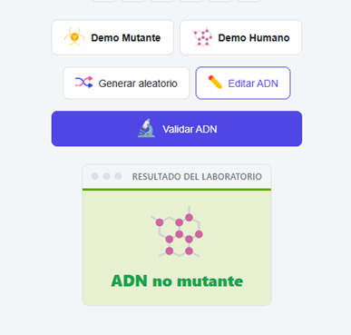
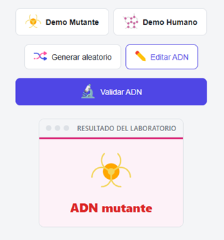

# Detector de Mutantes

Este proyecto implementa la solución al clásico reto de detección de mutantes mediante ADN.
El algoritmo recibe una matriz NxN compuesta por las bases nitrogenadas **A**, **T**, **C** y **G**, y determina si el ADN pertenece a un mutante buscando secuencias repetidas de cuatro letras consecutivas.

Sobre esa solución se construyó una aplicación web interactiva en Angular que permite visualizar y probar el algoritmo.

**Demo en vivo:** [detector-mutantes.vercel.app](https://detector-mutantes.vercel.app)

---

## Objetivo

El objetivo del proyecto no es únicamente detectar mutantes, sino ofrecer una interfaz visual que permita comprender, probar y validar el algoritmo de forma interactiva.

---

## Tecnologías utilizadas

- Angular 22
- TypeScript
- Signals
- CSS
- HTML5

---

## Descarga

Clona el repositorio en tu máquina:

```bash
git clone https://github.com/dejeloper/SETI_detector-mutantes.git
cd SETI_detector-mutantes
```

## Levantar el proyecto

Instala las dependencias y arranca el servidor de desarrollo:

```bash
pnpm install
pnpm start
```

Abre tu navegador en [http://localhost:4200](http://localhost:4200). Los cambios se reflejan automáticamente al guardar un archivo.

---

## Qué hace el proyecto

El ADN se representa como una matriz cuadrada (NxN) formada por las bases nitrogenadas: **A** (Adenina), **T** (Timina), **C** (Citosina) y **G** (Guanina). La aplicación recorre esa matriz buscando secuencias de **4 letras iguales consecutivas** en cuatro direcciones: horizontal, vertical y las dos diagonales.

Si encuentra **dos o más** de esas secuencias, el ADN pertenece a un **mutante**. Si encuentra una sola o ninguna, es de un **humano**.

Por ejemplo, en este ADN mutante hay una diagonal de cuatro "A" y una horizontal de cuatro "C":

```
A T G C G A
C A G T G C
T T A T G T
A G A A G G
C C C C T A
T C A C T G
```

---

## Algoritmo

El algoritmo inspecciona cada posición de la matriz como si pudiera ser el inicio de una secuencia.

Desde cada celda únicamente revisa cuatro direcciones:

- `→` Horizontal
- `↓` Vertical
- `↘` Diagonal principal
- `↙` Diagonal secundaria

Cuando encuentra cuatro letras consecutivas iguales incrementa un contador. En cuanto detecta **dos secuencias**, finaliza inmediatamente devolviendo `true` sin seguir recorriendo la matriz.

Antes de evaluar las secuencias, valida que la matriz sea cuadrada y que solo contenga las bases `A`, `T`, `C` y `G`.

## Complejidad

- **Tiempo:** O(N²)
- **Espacio:** O(1)

Cada posición de la matriz se evalúa como posible inicio de una secuencia en cuatro direcciones. Como el número de direcciones y el tamaño de cada comprobación son constantes (4), la complejidad total sigue siendo O(N²), sin estructuras auxiliares que crezcan con el tamaño de la matriz. El corte anticipado al llegar a dos secuencias reduce el trabajo real en la mayoría de los casos, especialmente en matrices grandes con mutantes fáciles de detectar.

---

## Cómo editar el ADN

La aplicación tiene dos formas de cargar ADN:

- **Demo Mutante / Demo Humano:** cargan ejemplos predefinidos para ver el resultado al instante.
- **Generar aleatorio:** crea una cuadrada al azar del mismo tamaño que la actual.

Para editar manualmente:

1. Haz clic en **Editar ADN**. La grilla cambia a modo edición con bordes resaltados.
2. Escribe directamente en cada celda. Solo se permiten las letras **A**, **T**, **C** y **G**. Si escribes otra cosa, la celda se borra y aparece un aviso.
3. Cuando termines, haz clic en **Guardar**. La aplicación validará automáticamente el ADN que acabas de editar.

---

## Capturas

| Inicio                                  | Modo edición                                       | Generar aleatorio                                     |
| --------------------------------------- | -------------------------------------------------- | ----------------------------------------------------- |
|  |  |  |

| Validación humano                                             | Validación mutante                                              |
| ------------------------------------------------------------- | --------------------------------------------------------------- |
|  |  |

| Resultado humano                                         | Resultado mutante                                          |
| -------------------------------------------------------- | ---------------------------------------------------------- |
|  |  |

---

## Persistencia

Lo que edites o cargues se guarda automáticamente en el navegador. Si cierras la pestaña y la vuelves a abrir, el ADN que tenías sigue ahí. Esto funciona con la memoria del navegador, así que si borras los datos del sitio, la grilla vuelve al ejemplo por defecto.

Si tienes dos pestañas abiertas al mismo tiempo, los cambios en una se reflejan en la otra automáticamente.

---

## Cómo funciona el código

El proyecto está hecho con **Angular 22** y está organizado en componentes pequeños que cada uno hace una cosa:

- **Board** (`board/`): es el coordinador. Decide qué se muestra, cuándo validar y qué hacer con los resultados.
- **Grid** (`grid/`): dibuja la matriz de ADN y permite editar las celdas cuando estás en modo edición.
- **Buttons** (`buttons/`): muestra los botones de acción (cargar demo, generar aleatorio, editar, validar).
- **Results** (`results/`): muestra el resultado de la validación con un icono que indica si es mutante o humano.
- **DNAService** (`core/services/`): contiene la lógica que decide si un ADN es mutante o no. Recorre la matriz, busca secuencias de cuatro letras iguales en las cuatro direcciones y cuenta cuántas encuentra.

```text
App -> Board(Grid, Buttons, Results) -> DNAService
```

---

## Decisiones de diseño

- El algoritmo está desacoplado de Angular: vive en `DNAService` y no depende de nada de la interfaz.
- Toda la lógica de negocio vive en el servicio; los componentes únicamente muestran información y emiten eventos.
- El recorrido termina en cuanto se encuentran dos secuencias, evitando trabajo innecesario.
- La edición se realiza sobre una copia de la matriz hasta que el usuario guarda los cambios, para no mutar el estado validado a mitad de la edición.

---

## Complejidad cognitiva

Cada componente y cada método tienen una única responsabilidad (ver [Decisiones de diseño](#decisiones-de-diseño)), lo que mantiene el código fácil de leer, depurar y modificar sin efectos secundarios inesperados.

La validación de cada celda al editar ocurre en tiempo real: antes de que el resultado se muestre, el código ya verificó que la matriz sea cuadrada y que solo tenga letras válidas, así el usuario se entera de inmediato si algo falla.
